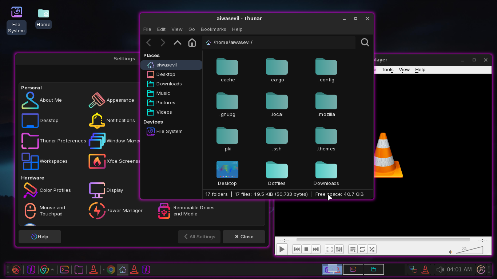

# 🐉 DragonHeart Dotfiles

Ini adalah koleksi Dotfiles rasmi untuk persediaan Arch Linux saya, memberi tumpuan kepada desktop **Xfce4 yang cantik dan berfungsi tinggi** dengan estetika **Garuda Linux** (Dr460nized) yang pantas dan ringan.

**Prinsip Utama:** Pemasangan pantas "masuk rumah cuci kaki" dengan semua utiliti Shell dan Multimedia yang disahkan.

## 📷 Desktop Preview

| Desktop | Terminal & Shell |
| :---: | :---: |
| [](assets/screenshots/Desktop.png) | [](assets/screenshots/terminal%20dengan%20fish.png) |

## ✨ Ciri-ciri Utama

* **Arch Linux Base:** Dicipta untuk kestabilan dan kelajuan Arch Linux.
* **Desktop Environment:** **Xfce4** — Ringan, tetapi berfungsi sepenuhnya.
* **Shell:** **Fish** dengan Prompt **Starship** dan **Fastfetch**.
* **File Managers:** **lsd** dan **eza** (Pengganti `ls` dan `tree` yang ikonik).
* **Display Manager:** **SDDM** dengan tema **Sugar Candy** (AUR).
* **Multimedia:** **VLC**, **PipeWire** (Audio), dan **yt-dlp** (Pemuat turun).
* **Automated Installation:** Skrip `install.sh` menguruskan *semua* kebergantungan.

## 🚀 Pemasangan (Bare Metal / VM)

Anda hanya perlu memasang sistem Arch Linux yang paling asas dan ikuti 3 langkah ini sebagai pengguna biasa (BUKAN `root`):

### 1. Klon Repositori

```bash
git clone [https://github.com/aiwasevil/DragonHeart.git](https://github.com/aiwasevil/DragonHeart.git) ~/Dotfiles
cd ~/Dotfiles
